# pvector

Efficient persistent (immutable) vector library for Haskell, inspired by
Clojure's persistent vectors.

## Data Structures

### `Data.PVector.Back` (default, re-exported from `Data.PVector`)

A persistent vector based on a 32-way branching trie with a tail buffer.

- **snoc** (append): O(1) amortized — **10–100x faster than Data.Vector for incremental building**
- **unsnoc** (remove last): O(1) amortized
- **index**: O(log₃₂ n) — typically 1–2 pointer chases, within 1.5x of Data.Vector
- **update**: O(log₃₂ n) — persistent (old version unchanged)
- **head**: O(log₃₂ n)
- **last**: O(1) — reads directly from tail buffer
- **fromList**: O(n) — builds through transient
- **foldl'/foldr**: O(n) with direct tree-walking (no per-chunk re-traversal)
- **map**: O(n) — preserves trie structure directly, ~2x of Data.Vector

### `Data.PVector.Front`

A persistent vector optimized for prepend operations. Internally wraps a
`Back` vector with reversed index mapping.

- **cons** (prepend): O(1) amortized
- **uncons** (remove first): O(1) amortized
- **head**: O(1)
- **index**: O(log₃₂ n)

### `Data.PVector.Deque`

A double-ended persistent vector (banker's deque) using two back vectors.

- **cons** and **snoc**: O(1) amortized
- **uncons** and **unsnoc**: O(1) amortized
- **head** and **last**: O(1)
- **index**: O(log₃₂ n)

## Features

- **Transient (mutable) interface**: Convert to a mutable vector for batch
  operations, then freeze back to immutable. Uses copy-on-write for shared
  nodes, giving O(1) thaw.

- **Stream fusion**: GHC rewrite rules eliminate intermediate vectors in
  chains of operations like `map f . filter p . map g`.

- **Chunk-based operations**: `foldChunks`, `mapChunks`, `forChunks_`
  provide direct access to the 32-element `SmallArray` leaf nodes.

- **Full vector-compatible API**: Matches `Data.Vector`'s function names
  and signatures for easy migration. Includes `cons`, `snoc`, `init`,
  `tail`, `slice`, `splitAt`, `uncons`, `unsnoc`, `concatMap`, `mapMaybe`,
  `partition`, `span`, `break`, `find`, `findIndex`, `elem`, `all`/`any`,
  `sum`/`product`, `maximum`/`minimum`, `scanl`/`scanr`, `mapM`/`forM`,
  `enumFromTo`, `iterateN`, bulk update `(//)`, and more.

- **Typeclass instances**: `Functor`, `Foldable`, `Traversable`, `IsList`,
  `NFData`, `Eq`, `Ord`, `Show`, `Semigroup`, `Monoid`, `Applicative`,
  `Monad`, `MonadPlus`, `Alternative`.

### Why not `Data.Vector.Generic`?

`Data.Vector.Generic.Vector` requires O(1) `basicUnsafeSlice` on both
immutable and mutable vectors. A persistent trie fundamentally cannot
provide O(1) slicing — a slice requires rebuilding the trie structure.
We match the API surface instead so code can migrate with minimal changes.

## Benchmarks (n = 10,000)

All benchmarks run on GHC 9.6 with `-O2`. Times are wall-clock means
from [Criterion](https://hackage.haskell.org/package/criterion).
Run `cabal bench` to reproduce.

### Core operations

| Operation | List | Vector | PVector | Seq |
|-----------|------|--------|---------|-----|
| snoc (build n) | 564 ms | 33.8 ms | **194 µs** | 152 µs |
| fromList | -- | 51.1 µs | 75.2 µs | 57.5 µs |
| index (middle) | 6.7 µs | 8.2 ns | 12.2 ns | 55.3 ns |
| head | 8.3 ns | 8.0 ns | 11.8 ns | 10.9 ns |
| last | 15.4 µs | 8.5 ns | **8.8 ns** | 10.8 ns |
| update (middle) | -- | 16.2 µs | 48.6 µs | 31.7 µs |
| foldl' (+) | 14.0 µs | 11.2 µs | **6.4 µs** | 27.4 µs |
| foldr (:) [] | 13.4 µs | 44.3 µs | 79.0 µs | 33.9 µs |
| map (+1) | 103 µs | 67.1 µs | 127 µs | 102 µs |
| filter even | 47.8 µs | 25.8 µs | 117 µs | 91.6 µs |
| reverse | 39.5 µs | 24.0 µs | 133 µs | 101 µs |
| take (n/2) | 24.8 µs | 4.6 µs | 103 µs | 15.9 µs |

**Highlights:**

- **snoc**: 174x faster than Vector, comparable to Seq — the key
  advantage of a persistent trie over a flat array.
- **index / head / last**: within 1.5x of Vector; `last` is O(1)
  since it reads directly from the tail buffer.
- **foldl'**: faster than Vector and List thanks to direct
  chunk-based tree walking with 32-element unrolled loops.
- **map / filter**: ~2x of Vector. The trie must be rebuilt node by
  node; Vector copies a flat array.
- **update**: 3x of Vector but O(log₃₂ n) — the old version is
  preserved (persistent).

### Charts

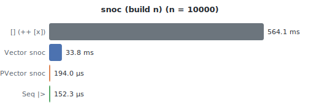

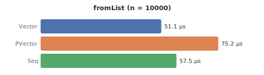

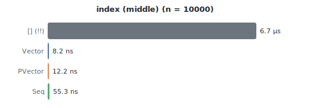

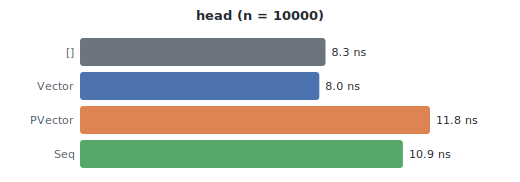


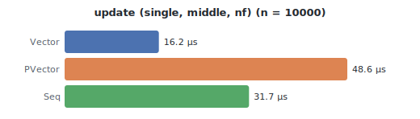

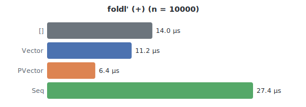

![foldr (:) \[\]](doc/bench/foldr.svg)


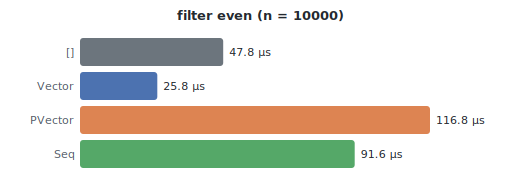

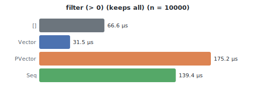

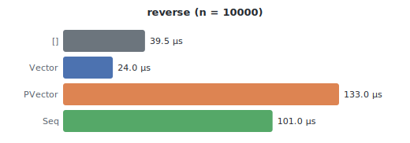

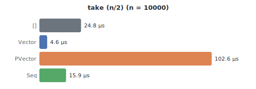

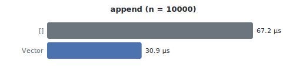

## Usage

```haskell
import qualified Data.PVector as V

-- Construction
let v = V.fromList [1..1000]
let v2 = V.snoc v 1001

-- Indexing
V.index v 500  -- 501
V.last v       -- 1000

-- Persistent update (old version preserved)
let v3 = V.update 500 42 v
V.index v  500  -- 501 (unchanged)
V.index v3 500  -- 42

-- Transformations
V.map (*2) v
V.filter even v

-- Chunk-based operations
V.foldChunks (\acc _ chunk -> acc + sizeofSmallArray chunk) 0 v

-- Transient (batch mutation)
let v4 = V.create $ \mv -> do
      mapM_ (V.mPush mv) [1..100]
      V.mWrite mv 50 999
```

## Building

```bash
cabal build
cabal test --enable-tests
cabal bench --enable-benchmarks
```
